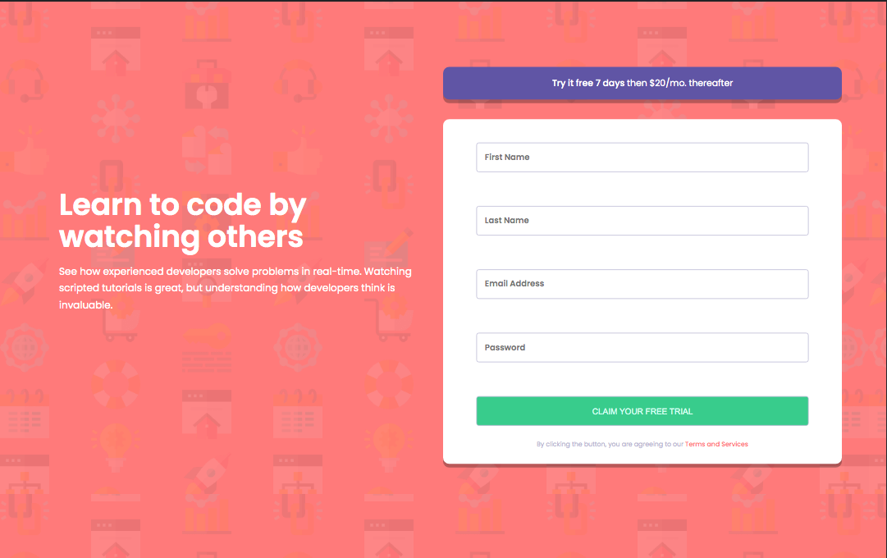

# Frontend Mentor - Intro component with sign up form solution

This is a solution to the [Intro component with sign up form challenge on Frontend Mentor](https://www.frontendmentor.io/challenges/intro-component-with-signup-form-5cf91bd49edda32581d28fd1). Frontend Mentor challenges help you improve your coding skills by building realistic projects. 

## Table of contents

- [Overview](#overview)
  - [The challenge](#the-challenge)
  - [Screenshot](#screenshot)
  - [Links](#links)
- [My process](#my-process)
  - [Built with](#built-with)
  - [What I learned](#what-i-learned)
  - [Continued development](#continued-development)
  - [Useful resources](#useful-resources)
- [Author](#author)


## Overview

### The challenge

Users should be able to:

- View the optimal layout for the site depending on their device's screen size
- See hover states for all interactive elements on the page
- Receive an error message when the `form` is submitted if:
  - Any `input` field is empty. The message for this error should say *"[Field Name] cannot be empty"*
  - The email address is not formatted correctly (i.e. a correct email address should have this structure: `name@host.tld`). The message for this error should say *"Looks like this is not an email"*

### Screenshot




### Links

- Solution URL: [https://github.com/hexachordal/intro-component-with-signup-form-master](https://github.com/hexachordal/intro-component-with-signup-form-master)
- Live Site URL: [https://hexachordal.github.io/intro-component-with-signup-form-master/](https://hexachordal.github.io/intro-component-with-signup-form-master/)

## My process

### Built with

- Semantic HTML5 markup
- SASS
- CSS Grid
- Mobile-first workflow
- Javascript


### What I learned

I worked on this form for close to a month on and off and learned so much. I dove a bit into form tags and authentication but realized since I am hosting it on a static server, it would not really work (as far as I know). Instead, I did my own form authentication using javascript to make the errors appear and disappear which was really fun. Here's a snippet of that:

```js
formItem[0].onchange= function valid(){
        if(invalid[0].style.color === "rgb(255, 122, 122)"){
            invalid[0].style.color = "white";
            formItem[0].style.backgroundImage = "none";
            formItem[0].style.border= "1px solid hsl(246, 25%, 77%)";
            
        }
    }

    button[0].onclick= function error(){
        

        if(formItem[0].value === ""){
            invalid[0].style.color = "rgb(255, 122, 122)";
            formItem[0].style.backgroundImage = `url("images/icon-error.svg")`;
            formItem[0].style.border= "1px solid rgb(255, 122, 122)";
            
        }
```

I did not do anything particularly fancy with my css nor did I find myself using many variables in SASS. Hopefully I'll start to harness the power of SASS better. However, I did enjoy learning more about grid and bending components to my will:

```css
#bCard{
  display: grid;
  place-items: center;
  background-color: white;
  grid-column: 3 / 4;
  grid-row: 3 / 4;
}
```

I learned about 'em' recently so I am going to start replacing my 'rem' with 'em' because I feel like it is a more consistent measure (any tips on that are welcome).


### Continued development

I worked pretty hard on getting this to match the design so I am quite pleased with how it turned out. If I were to come back to it, I would refactor my sass to get rid of some repetition. My footer is also not the greatest on some screensizes and I am feeling pretty ready to dive into adding some JQuery.

### Useful resources


- [CSS-tricks](https://css-tricks.com/snippets/css/complete-guide-grid/#important-terminology) - This helped me a lot with understanding grid especially when redoing the design for desktop
- [w3resource](https://www.w3resource.com/javascript/form/email-validation.php) - I used this one to get a regex for email validation which was super helpful.
- [Mozilla](https://developer.mozilla.org/en-US/docs/Web/API/GlobalEventHandlers/onchange) - When trying to decide on checking errors, using 'onchange' seemed to be my best bet and this was a helpful resource to remind me how to implement it.


## Author

- Website - [Francois Harewood](https://github.com/hexachordal)
- Frontend Mentor - [@hexachordal](https://www.frontendmentor.io/profile/hexachordal)


